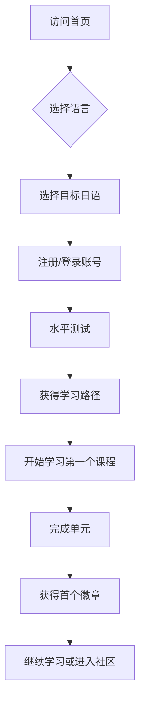
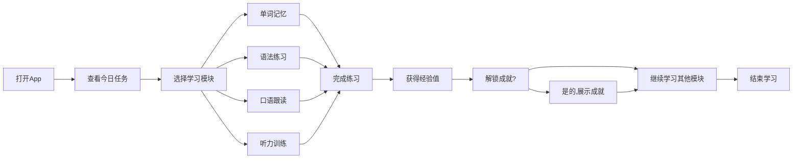
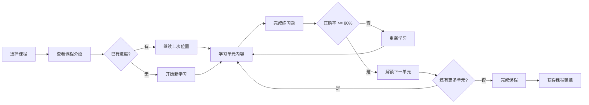

# 多语种在线教育平台 - 产品需求文档

## 1. 产品概述

**LinguaLearn** 是一款沉浸式多语种在线学习平台，支持英语、日语、韩语等主流语言的学习。平台通过互动式学习体验、智能进度追踪和个性化学习路径，帮助用户高效掌握目标语言。

### 目标用户
- 语言学习初学者到中级学习者
- 希望提升职场竞争力的职场人士
- 对外语文化感兴趣的学习爱好者

### 核心价值
- 沉浸式学习体验，告别传统枯燥记忆
- 科学的分级体系，从零基础到流利表达
- 智能进度追踪，见证每一步成长

---

## 2. 核心功能模块

### 2.1 用户角色

| 角色 | 注册方式 | 核心权限 |
|------|---------|---------|
| 游客 | - | 浏览公开课程、查看平台介绍 |
| 注册用户 | 邮箱/手机号 | 完整学习功能、进度追踪、社区互动 |
| VIP用户 | 付费升级 | 高级课程、一对一辅导、无广告体验 |

### 2.2 功能模块总览

1. **首页与引导模块** - 平台介绍、语言选择、学习目标设定
2. **用户认证系统** - 注册、登录、个人中心
3. **分级课程体系** - 语言选择、难度分级、课程内容
4. **互动学习模块** - 单词记忆、语法练习、口语跟读、听力训练
5. **学习进度追踪** - 仪表盘、数据统计、成就展示
6. **个性化推荐** - 学习路径规划、智能课程推荐
7. **社区交流系统** - 学习小组、话题讨论、经验分享
8. **成就激励系统** - 徽章、排行榜、学习 streaks

---

## 3. 页面详细设计

### 3.1 首页 (Home)

**模块结构：**
- **Hero 区域**：沉浸式语言展示，3D 地球动画效果，支持语言切换
- **语言选择卡片**：英语、日语、韩语三大语言入口，带学习人数统计
- **特色功能展示**：互动学习、进度追踪、个性化推荐三大核心功能介绍
- **用户评价轮播**：真实学习者反馈，增加信任度
- **底部 CTA**：注册引导按钮

### 3.2 用户认证页面

**注册流程：**
- 步骤 1：基本信息（邮箱/手机、密码、昵称）
- 步骤 2：学习目标（选择语言、设定目标）
- 步骤 3：水平测试（可选，快速定位学习起点）

**登录页面：**
- 邮箱/手机 + 密码登录
- 记住登录状态
- 忘记密码功能

### 3.3 学习中心 (Dashboard)

**主要模块：**
- **今日学习卡片**：显示今日学习 streak、待完成任务
- **学习进度圆环**：视觉化展示总体进度
- **快捷学习入口**：单词、语法、口语、听力四个模块快速入口
- **推荐课程列表**：基于用户水平的个性化推荐
- **成就展示区**：最新获得的徽章、最近达成的里程碑

### 3.4 课程页面 (Courses)

**功能：**
- **语言切换标签**：英语、日语、韩语快速切换
- **难度级别导航**：A1-C2（CEFR 标准）或对应等级
- **课程卡片列表**：
  - 课程封面图
  - 课程名称（带语言标记）
  - 难度等级
  - 学习人数
  - 预计完成时间
  - 进度条（已登录用户）
- **课程详情页**：
  - 课程介绍视频/图片
  - 学习目标列表
  - 课程大纲
  - 单元列表（可展开）
  - 开始/继续学习按钮

### 3.5 互动学习模块

#### 5.1 单词记忆 (Vocabulary)
- **学习模式**：闪卡翻转、选择题、拼写练习
- **复习系统**：基于艾宾浩斯遗忘曲线
- **记忆技巧**：联想记忆、例句展示
- **发音示范**：native speaker 音频

#### 5.2 语法练习 (Grammar)
- **互动教程**：图文并茂的语法讲解
- **练习题型**：填空、改错、造句
- **即时反馈**：错误解释、正确示范
- **语法笔记**：用户可添加个人笔记

#### 5.3 口语跟读 (Speaking)
- **跟读练习**：播放音频后录音跟读
- **语音评分**：AI 实时评分（1-100分）
- **对比播放**：原声与跟读对比播放
- **难点标注**：标记发音困难单词

#### 5.4 听力训练 (Listening)
- **听力材料**：日常对话、新闻、故事
- **练习模式**：听写填空、选择题、判断题
- **语速调节**：0.5x - 1.5x 可调
- **循环播放**：难点句子重复播放

### 3.6 学习进度页面

**数据展示：**
- **总学习时长**：累计学习时间
- **学习 streak**：连续学习天数
- **完成课程数**：已完成的课程/单元数
- **正确率趋势**：练习正确率变化图
- **各模块进度**：单词、语法、口语、听力独立进度

**统计图表：**
- 周学习热力图（类似 GitHub contributions）
- 月度学习趋势折线图
- 模块占比饼图

### 3.7 个性化推荐页面

**推荐依据：**
- 用户水平测试结果
- 学习目标（考试、日常交流、旅行等）
- 学习历史和偏好
- 学习时间和频率

**推荐内容：**
- 每日学习计划
-薄弱环节强化课程
- 同水平热门课程
- 学习路径规划

### 3.8 社区页面

**功能模块：**
- **话题广场**：按语言和话题分类的讨论区
- **学习小组**：按语言和目标组建的学习群组
- **经验分享**：学习技巧、方法分享文章
- **问答专区**：学习问题求助
- **用户动态**：关注用户的最新学习动态

### 3.9 成就中心

**成就类型：**
- **里程碑徽章**：首次登录、完成首课、连续学习7天等
- **技能徽章**：单词量突破、语法掌握、口语流利度
- **探索徽章**：体验所有模块、完成所有难度等级
- **社区徽章**：参与讨论、帮助他人、活跃度

**排行榜：**
- 周学习时长排行
- 连续学习 streak 排行
- 成就数量排行
- 社区活跃度排行

### 3.10 个人中心

**功能：**
- **个人信息**：头像、昵称、邮箱、学习目标
- **学习设置**：每日学习目标、学习提醒时间
- **账户设置**：修改密码、账号绑定
- **VIP管理**：查看会员状态、升级/续费
- **学习数据导出**：导出学习记录

---

## 4. 核心用户流程

### 4.1 新用户首次使用流程



### 4.2 日常学习流程



### 4.3 课程学习流程



---

## 5. UI/UX 设计规范

### 5.1 设计风格

**主题定位**：现代感与活力并存的沉浸式学习体验

**视觉特点：**
- **圆润设计**：所有卡片和按钮采用 16px-24px 圆角
- **柔和阴影**：subtle box-shadows，营造层次感
- **渐变色彩**：主要按钮使用 135° 对角渐变
- **图标风格**：线性图标 + 实心图标混合，圆润线条
- **插图风格**：现代扁平插画，带有活力色彩

### 5.2 色彩系统

**主色调：**
```css
--primary-gradient: linear-gradient(135deg, #667eea 0%, #764ba2 100%);
--primary-light: #818cf8;
--primary-dark: #4f46e5;
```

**辅助色：**
```css
--success: #10b981;  /* 绿色 - 正确/成功 */
--warning: #f59e0b; /* 橙色 - 警告/提醒 */
--error: #ef4444;    /* 红色 - 错误/失败 */
--info: #3b82f6;     /* 蓝色 - 信息/链接 */
```

**语言专属色：**
```css
--english-color: #3b82f6;  /* 英语 - 蓝色 */
--japanese-color: #ef4444; /* 日语 - 红色 */
--korean-color: #8b5cf6;   /* 韩语 - 紫色 */
```

### 5.3 字体规范

**标题字体：**
- 中文：思源黑体 (Noto Sans SC) Bold
- 英文/日文：Poppins Bold
- 大小范围：24px - 48px

**正文字体：**
- 中文：思源黑体 (Noto Sans SC) Regular
- 英文：Inter Regular
- 日文：Noto Sans JP
- 大小范围：14px - 16px

### 5.4 布局规范

**桌面端：**
- 最大宽度：1280px
- 栅格系统：12 列
- 间距基准：8px
- 卡片间距：24px
- 内容区 padding：48px

**移动端：**
- 最小宽度：375px
- 卡片间距：16px
- 内容区 padding：16px

### 5.5 动效规范

**页面过渡：**
- 淡入时长：300ms ease-out
- 滑入时长：400ms cubic-bezier(0.4, 0, 0.2, 1)

**交互动效：**
- 按钮悬停：scale(1.02), 150ms
- 卡片悬停：translateY(-4px), box-shadow 增强
- 加载动画：旋转圆环 + 脉冲效果

**学习反馈：**
- 正确回答：绿色闪烁 + 粒子效果
- 错误回答：红色抖动 + 提示信息
- 进度更新：数字滚动 + 进度条动画

### 5.6 响应式策略

**断点设置：**
```css
/* 移动端 */
@media (max-width: 768px) { ... }

/* 平板 */
@media (min-width: 769px) and (max-width: 1024px) { ... }

/* 桌面端 */
@media (min-width: 1025px) { ... }
```

---

## 6. 非功能性需求

### 6.1 性能要求
- 首屏加载时间 < 3秒
- 页面切换 < 300ms
- 音频加载 < 2秒

### 6.2 兼容性要求
- 浏览器支持：Chrome、Firefox、Safari、Edge 最新两个版本
- 移动端支持：iOS 12+、Android 8+
- 渐进增强：核心功能优先，交互效果降级处理

### 6.3 可访问性
- 色彩对比度符合 WCAG AA 标准
- 支持键盘导航
- 适当的 ARIA 标签
- 支持屏幕阅读器

### 6.4 数据安全
- 用户密码加密存储
- 敏感信息 HTTPS 传输
- Session 超时自动登出

---

## 7. 成功指标

### 7.1 用户指标
- 用户注册转化率 > 30%
- 首次学习完成率 > 60%
- 7日留存率 > 40%
- 日活用户平均学习时长 > 15分钟

### 7.2 功能指标
- 学习模块使用率：单词 > 口语 > 语法 > 听力
- 课程完成率 > 50%
- 社区帖子回复率 > 70%
- 成就解锁率 > 80%（首个成就）

### 7.3 技术指标
- 系统可用性 > 99.9%
- API 响应时间 < 200ms
- 错误率 < 0.1%
