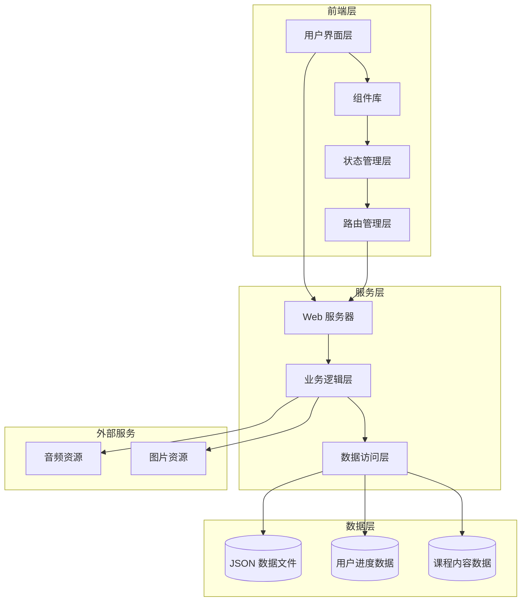

# 多语种在线教育平台 - 技术架构文档

## 1. 系统架构设计

### 1.1 整体架构概览

本项目采用前后端分离的现代化 Web 应用架构，前端使用 React 框架构建单页应用，后端采用 Express 提供 RESTful API 接口，数据存储使用本地 JSON 文件模拟数据库。



### 1.2 技术栈选型

| 类别 | 技术方案 | 版本号 | 说明 |
|------|---------|--------|------|
| 前端框架 | React | 18.x | 函数式组件 + Hooks |
| 构建工具 | Vite | 5.x | 快速热更新和构建 |
| 路由管理 | React Router | 6.x | 客户端路由 |
| 状态管理 | React Context | 内置 | 全局状态管理 |
| 样式方案 | Tailwind CSS | 3.x | 原子化 CSS |
| HTTP 客户端 | Fetch API | 内置 | 原生数据请求 |
| 图表库 | Recharts | 2.x | 数据可视化 |
| 音频处理 | Web Audio API | 内置 | 口语评分支持 |
| 日期处理 | Day.js | 1.x | 轻量级日期库 |

---

## 2. 项目目录结构

```
learn-app/
├── public/                      # 静态资源目录
│   ├── images/                 # 图片资源
│   ├── audio/                  # 音频资源
│   └── icons/                  # 图标文件
├── src/                        # 源代码目录
│   ├── components/             # 通用组件
│   │   ├── common/            # 基础组件
│   │   │   ├── Button.jsx     # 按钮组件
│   │   │   ├── Card.jsx       # 卡片组件
│   │   │   ├── Input.jsx      # 输入框组件
│   │   │   ├── Modal.jsx      # 弹窗组件
│   │   │   └── Progress.jsx   # 进度条组件
│   │   ├── layout/            # 布局组件
│   │   │   ├── Header.jsx     # 顶部导航
│   │   │   ├── Sidebar.jsx    # 侧边栏
│   │   │   └── Footer.jsx     # 底部
│   │   └── learning/          # 学习相关组件
│   │       ├── FlashCard.jsx  # 闪卡组件
│   │       ├── QuizCard.jsx   # 测验卡片
│   │       ├── AudioPlayer.jsx # 音频播放器
│   │       └── RecordingBox.jsx # 录音组件
│   ├── pages/                 # 页面组件
│   │   ├── Home.jsx           # 首页
│   │   ├── Login.jsx          # 登录页
│   │   ├── Register.jsx       # 注册页
│   │   ├── Dashboard.jsx      # 学习仪表盘
│   │   ├── Courses.jsx        # 课程列表页
│   │   ├── CourseDetail.jsx   # 课程详情页
│   │   ├── Vocabulary.jsx     # 单词学习页
│   │   ├── Grammar.jsx       # 语法练习页
│   │   ├── Speaking.jsx       # 口语跟读页
│   │   ├── Listening.jsx      # 听力训练页
│   │   ├── Progress.jsx       # 进度追踪页
│   │   ├── Community.jsx      # 社区页
│   │   ├── Achievements.jsx   # 成就中心页
│   │   └── Profile.jsx        # 个人中心页
│   ├── context/               # React Context
│   │   ├── AuthContext.jsx    # 认证上下文
│   │   ├── LearningContext.jsx # 学习上下文
│   │   └── ProgressContext.jsx # 进度上下文
│   ├── hooks/                 # 自定义 Hooks
│   │   ├── useAuth.js         # 认证相关钩子
│   │   ├── useProgress.js     # 进度相关钩子
│   │   └── useAudio.js        # 音频相关钩子
│   ├── services/              # 服务层
│   │   ├── api.js             # API 请求封装
│   │   ├── auth.js            # 认证服务
│   │   ├── courses.js         # 课程服务
│   │   ├── progress.js        # 进度服务
│   │   └── community.js       # 社区服务
│   ├── data/                  # 静态数据
│   │   ├── courses.js         # 课程数据
│   │   ├── vocabulary.js      # 单词数据
│   │   ├── grammar.js         # 语法数据
│   │   ├── achievements.js    # 成就数据
│   │   └── mockUsers.js       # 模拟用户数据
│   ├── utils/                 # 工具函数
│   │   ├── helpers.js         # 通用工具
│   │   ├── storage.js         # 本地存储
│   │   └── validators.js      # 表单验证
│   ├── styles/                # 样式文件
│   │   └── globals.css         # 全局样式
│   ├── App.jsx                # 应用根组件
│   └── main.jsx               # 应用入口
├── server/                    # 后端服务（模拟）
│   ├── routes/                # 路由定义
│   │   ├── auth.js            # 认证路由
│   │   ├── courses.js         # 课程路由
│   │   ├── progress.js        # 进度路由
│   │   └── community.js       # 社区路由
│   ├── controllers/           # 控制器
│   ├── services/             # 业务逻辑
│   ├── data/                  # JSON 数据文件
│   │   ├── users.json         # 用户数据
│   │   ├── progress.json      # 进度数据
│   │   └── posts.json         # 社区帖子数据
│   └── server.js              # 服务器入口
├── package.json               # 项目配置
├── vite.config.js            # Vite 配置
├── tailwind.config.js        # Tailwind 配置
└── index.html                # HTML 入口
```

---

## 3. 路由定义

### 3.1 前端路由表

| 路由路径 | 页面名称 | 访问权限 | 功能描述 |
|---------|---------|---------|---------|
| / | 首页 | 公开 | 平台介绍、语言选择、注册引导 |
| /login | 登录页 | 公开 | 用户登录 |
| /register | 注册页 | 公开 | 新用户注册 |
| /dashboard | 学习仪表盘 | 需登录 | 今日任务、快捷入口、进度总览 |
| /courses | 课程列表 | 需登录 | 浏览和筛选课程 |
| /courses/:id | 课程详情 | 需登录 | 课程内容、学习单元 |
| /learn/vocabulary | 单词记忆 | 需登录 | 闪卡学习、复习系统 |
| /learn/grammar | 语法练习 | 需登录 | 互动教程、练习题 |
| /learn/speaking | 口语跟读 | 需登录 | 录音跟读、语音评分 |
| /learn/listening | 听力训练 | 需登录 | 听力材料、练习测试 |
| /progress | 进度追踪 | 需登录 | 学习数据、统计图表 |
| /community | 社区广场 | 需登录 | 话题讨论、学习小组 |
| /achievements | 成就中心 | 需登录 | 徽章展示、排行榜 |
| /profile | 个人中心 | 需登录 | 个人信息、账户设置 |

### 3.2 路由守卫策略

```javascript
// 路由守卫逻辑
const ProtectedRoute = ({ children }) => {
  const { isAuthenticated } = useAuth();
  
  if (!isAuthenticated) {
    return <Navigate to="/login" replace />;
  }
  
  return children;
};

// 公开路由（已登录用户访问自动跳转）
const PublicRoute = ({ children }) => {
  const { isAuthenticated } = useAuth();
  
  if (isAuthenticated) {
    return <Navigate to="/dashboard" replace />;
  }
  
  return children;
};
```

---

## 4. API 接口定义

### 4.1 认证模块

#### 用户注册
```typescript
// POST /api/auth/register
interface RegisterRequest {
  email: string;
  password: string;
  nickname: string;
  targetLanguage: 'english' | 'japanese' | 'korean';
}

interface RegisterResponse {
  success: boolean;
  user: {
    id: string;
    email: string;
    nickname: string;
    targetLanguage: string;
    level: string;
    createdAt: string;
  };
  token: string;
}
```

#### 用户登录
```typescript
// POST /api/auth/login
interface LoginRequest {
  email: string;
  password: string;
}

interface LoginResponse {
  success: boolean;
  user: User;
  token: string;
}
```

### 4.2 课程模块

#### 获取课程列表
```typescript
// GET /api/courses?language=english&level=A1
interface CoursesResponse {
  courses: Array<{
    id: string;
    title: string;
    language: string;
    level: string;
    coverImage: string;
    totalUnits: number;
    completedUnits: number;
    duration: number; // 分钟
    enrolledCount: number;
  }>;
}
```

#### 获取课程详情
```typescript
// GET /api/courses/:id
interface CourseDetailResponse {
  id: string;
  title: string;
  description: string;
  language: string;
  level: string;
  objectives: string[];
  units: Array<{
    id: string;
    title: string;
    completed: boolean;
    duration: number;
  }>;
}
```

### 4.3 学习进度模块

#### 记录学习进度
```typescript
// POST /api/progress
interface ProgressRequest {
  type: 'vocabulary' | 'grammar' | 'speaking' | 'listening';
  action: 'start' | 'complete' | 'quiz';
  itemId: string;
  score?: number;
  duration: number;
}

interface ProgressResponse {
  success: boolean;
  xp: number;
  level: number;
  achievements: Achievement[];
}
```

#### 获取学习数据
```typescript
// GET /api/progress/stats
interface ProgressStatsResponse {
  totalStudyTime: number; // 分钟
  currentStreak: number; // 天
  longestStreak: number;
  totalXp: number;
  level: number;
  modulesProgress: {
    vocabulary: number; // 百分比
    grammar: number;
    speaking: number;
    listening: number;
  };
  weeklyData: Array<{
    date: string;
    minutes: number;
    xp: number;
  }>;
}
```

### 4.4 社区模块

#### 获取帖子列表
```typescript
// GET /api/community/posts?language=english&page=1&limit=20
interface PostsResponse {
  posts: Array<{
    id: string;
    author: {
      id: string;
      nickname: string;
      avatar: string;
    };
    language: string;
    title: string;
    content: string;
    likes: number;
    comments: number;
    createdAt: string;
  }>;
  pagination: {
    page: number;
    limit: number;
    total: number;
    totalPages: number;
  };
}
```

#### 发布帖子
```typescript
// POST /api/community/posts
interface CreatePostRequest {
  language: string;
  title: string;
  content: string;
}

interface CreatePostResponse {
  success: boolean;
  post: Post;
}
```

---

## 5. 数据模型设计

### 5.1 用户数据模型

```mermaid
erDiagram
    USER ||--o{ PROGRESS : has
    USER ||--o{ COURSE_ENROLLMENT : enrolls
    USER ||--o{ ACHIEVEMENT : unlocks
    USER ||--o{ POST : creates
    USER ||--o{ COMMENT : writes
    
    USER {
        string id PK
        string email UK
        string password_hash
        string nickname
        string avatar
        string target_language
        string current_level
        int total_xp
        int current_streak
        datetime created_at
        datetime last_login
    }
    
    PROGRESS {
        string id PK
        string user_id FK
        string module_type
        string item_id
        int score
        int duration
        datetime completed_at
    }
    
    COURSE_ENROLLMENT {
        string id PK
        string user_id FK
        string course_id
        int completed_units
        datetime enrolled_at
        datetime last_accessed
    }
    
    ACHIEVEMENT {
        string id PK
        string user_id FK
        string achievement_id
        datetime unlocked_at
    }
    
    POST {
        string id PK
        string user_id FK
        string language
        string title
        string content
        int likes
        datetime created_at
    }
    
    COMMENT {
        string id PK
        string user_id FK
        string post_id FK
        string content
        datetime created_at
    }
}
```

### 5.2 课程数据结构

```typescript
interface Course {
  id: string;
  title: string;
  description: string;
  language: 'english' | 'japanese' | 'korean';
  level: 'A1' | 'A2' | 'B1' | 'B2' | 'C1' | 'C2';
  coverImage: string;
  totalUnits: number;
  duration: number; // 总时长（分钟）
  enrolledCount: number;
  objectives: string[];
  units: Unit[];
}

interface Unit {
  id: string;
  title: string;
  type: 'vocabulary' | 'grammar' | 'dialogue' | 'exercise';
  duration: number;
  content: UnitContent;
}

interface UnitContent {
  words?: VocabularyItem[];
  grammarPoints?: GrammarPoint[];
  dialogues?: Dialogue[];
  exercises?: Exercise[];
}
```

### 5.3 成就数据结构

```typescript
interface Achievement {
  id: string;
  title: string;
  description: string;
  icon: string;
  category: 'milestone' | 'skill' | 'exploration' | 'social';
  requirement: {
    type: string;
    value: number;
  };
  xpReward: number;
}

interface UserAchievement {
  achievementId: string;
  unlockedAt: string;
}
```

---

## 6. 核心功能实现方案

### 6.1 用户认证系统

**实现要点：**

1. **注册流程**
   - 前端表单验证（邮箱格式、密码强度）
   - 密码使用 bcrypt 加密（模拟）
   - 生成 JWT token
   - 存储用户基本信息到 LocalStorage

2. **登录流程**
   - 验证邮箱和密码
   - 更新最后登录时间
   - 返回用户信息和 token
   - 写入认证 Context

3. **状态持久化**
   - 使用 AuthContext 管理全局认证状态
   - 应用启动时检查 LocalStorage 中的 token
   - token 有效期 7 天，过期自动登出

### 6.2 分级课程体系

**课程难度划分：**

| 等级 | 名称 | 词汇量要求 | 学习目标 |
|------|------|-----------|---------|
| A1 | 入门级 | 500-1000 | 基础问候、自我介绍 |
| A2 | 初级 | 1000-2000 | 日常交流、简单对话 |
| B1 | 中级 | 2000-4000 | 流利对话、工作沟通 |
| B2 | 中高级 | 4000-6000 | 专业讨论、深度交流 |
| C1 | 高级 | 6000-10000 | 原版阅读、专业写作 |
| C2 | 精通级 | 10000+ | 母语级表达 |

### 6.3 互动学习模块

#### 6.3.1 单词记忆系统

**实现方案：**

```typescript
// 闪卡学习算法
interface FlashCardSystem {
  cards: VocabularyItem[];
  currentIndex: number;
  studyMode: 'learning' | 'review';
  
  // 基于艾宾浩斯遗忘曲线
  getNextReviewDate: (quality: number, interval: number) => Date;
  
  // SM-2 算法计算复习间隔
  calculateInterval: (quality: number, easiness: number) => number;
}
```

**功能特性：**

- 翻转式闪卡动画（3D transform）
- 掌握程度标记（模糊→认识→忘记）
- 复习提醒推送
- 学习进度可视化

#### 6.3.2 口语跟读系统

**实现方案：**

```typescript
// 录音跟读流程
interface SpeakingExercise {
  promptText: string;
  audioUrl: string;
  
  // 录音功能
  startRecording: () => Promise<void>;
  stopRecording: () => Promise<Blob>;
  
  // 评分模拟
  evaluate: (audioBlob: Blob) => Promise<{
    score: number;
    feedback: string;
    pronunciationTips: string[];
  }>;
  
  // 波形可视化
  drawWaveform: (audioBuffer: AudioBuffer) => void;
}
```

**功能特性：**

- Web Audio API 录音
- 音频波形实时显示
- 原声与跟读对比播放
- 模拟评分系统（基于音素检测）

#### 6.3.3 听力训练系统

**实现方案：**

```typescript
// 听力练习组件
interface ListeningExercise {
  audioUrl: string;
  playbackSpeed: number; // 0.5 - 1.5
  transcript: string;
  
  // 练习模式
  mode: 'dictation' | 'choice' | 'trueFalse';
  
  // 播放器控制
  play: () => void;
  pause: () => void;
  seek: (time: number) => void;
  setSpeed: (speed: number) => void;
  loop: (start: number, end: number) => void;
}
```

### 6.4 进度追踪系统

**数据采集点：**

1. 每日学习时长
2. 完成的学习单元
3. 练习正确率
4. 口语跟读分数
5. 听力测试得分

**数据可视化：**

- 周学习热力图（7x4 网格）
- 月度学习趋势图（折线图）
- 模块进度占比（环形图）
- Streak 日历视图

### 6.5 个性化推荐系统

**推荐算法：**

```typescript
interface RecommendationEngine {
  // 基于用户水平的推荐
  getLevelCourses: (userLevel: string, language: string) => Course[];
  
  // 基于学习历史的推荐
  getWeakModules: (progress: Progress) => string[];
  
  // 生成学习计划
  generateDailyPlan: (user: User, progress: Progress) => LearningPlan;
  
  // 预测下一个难度
  predictNextLevel: (performance: PerformanceData) => string;
}
```

---

## 7. 性能优化策略

### 7.1 前端优化

| 优化项 | 实现方案 | 预期效果 |
|-------|---------|---------|
| 代码分割 | React.lazy + Suspense | 首屏加载减少 40% |
| 图片懒加载 | Intersection Observer | 减少初始流量 |
| 状态缓存 | useMemo + useCallback | 减少重渲染 |
| 音频预加载 | Preload 属性 | 音频秒开 |
| 虚拟列表 | react-window | 长列表流畅滚动 |

### 7.2 资源优化

```typescript
// 图片优化配置
const imageConfig = {
  formats: ['webp', 'avif'],
  sizes: {
    thumbnail: '150x150',
    card: '400x300',
    hero: '1920x1080'
  },
  lazyLoad: true,
  placeholder: 'blur'
};

// 音频优化配置
const audioConfig = {
  preload: 'metadata',
  formats: ['mp3', 'ogg'],
  compression: 128
};
```

---

## 8. 安全考虑

### 8.1 前端安全

- XSS 防护：React 自动转义
- 表单验证：前端 + 后端双重验证
- CSRF：使用 SameSite Cookie
- 敏感数据：避免 localStorage 存储敏感信息

### 8.2 认证安全

- 密码强度要求：至少 8 位，包含字母和数字
- Token 管理：设置过期时间，定期刷新
- 会话管理：30 分钟无操作自动登出

---

## 9. 部署方案

### 9.1 开发环境
- Vite Dev Server
- 热模块替换（HMR）
- API Mock Server

### 9.2 生产环境
- 构建产物：静态文件
- 部署平台：Vercel / Netlify
- CDN：静态资源加速
- HTTPS：强制启用

---

## 10. 测试策略

### 10.1 测试覆盖

| 测试类型 | 覆盖范围 | 工具 |
|---------|---------|------|
| 单元测试 | 工具函数、组件逻辑 | Vitest |
| 集成测试 | API 接口、页面流程 | React Testing Library |
| E2E 测试 | 完整用户流程 | Playwright |
| 性能测试 | 首屏加载、交互响应 | Lighthouse |

### 10.2 测试用例优先级

1. 核心学习流程（单词、语法、口语、听力）
2. 用户认证流程（注册、登录、登出）
3. 进度追踪功能
4. 成就解锁系统
5. 社区互动功能
